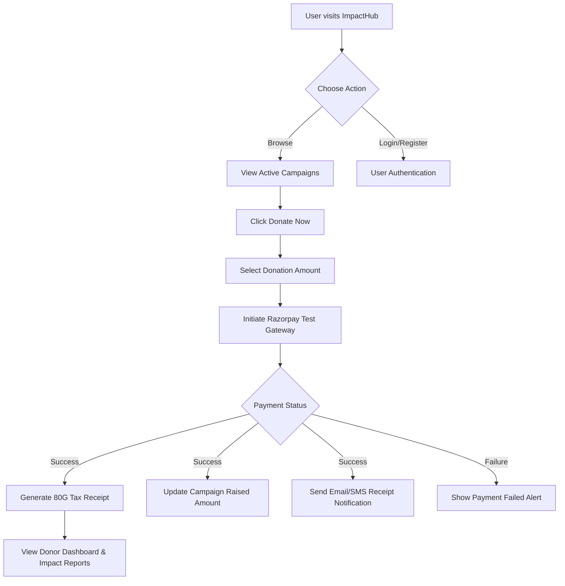
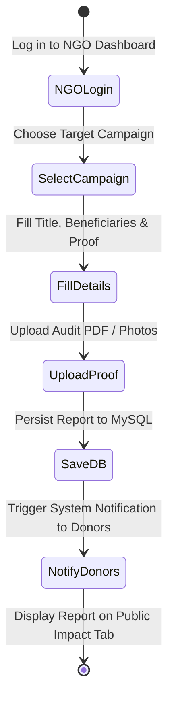
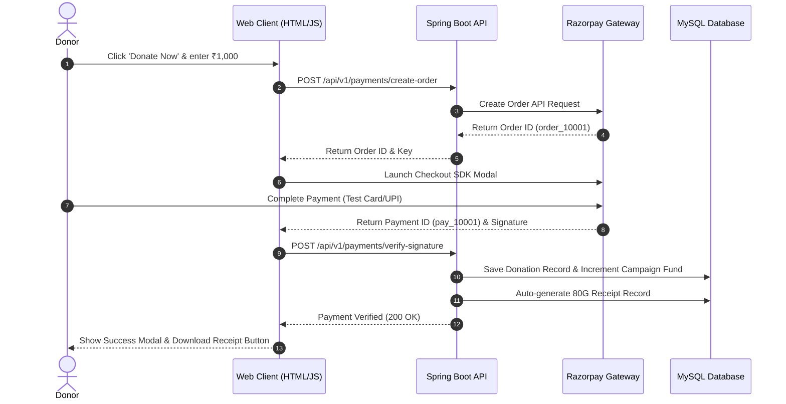
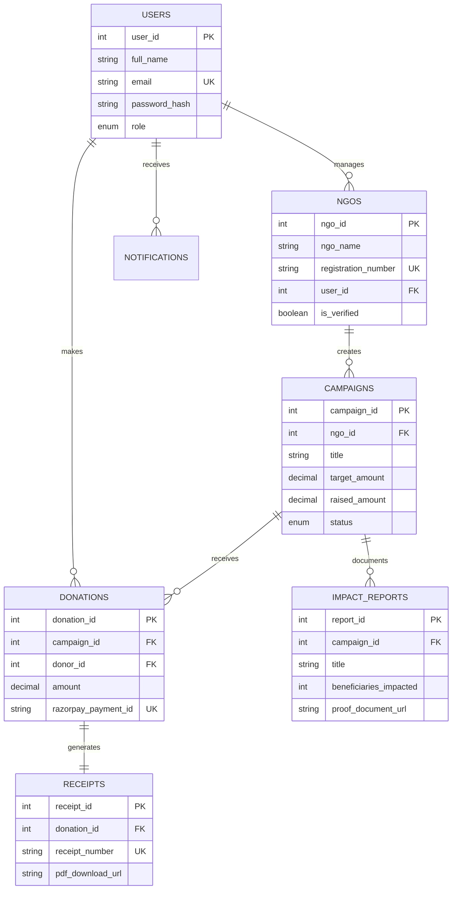
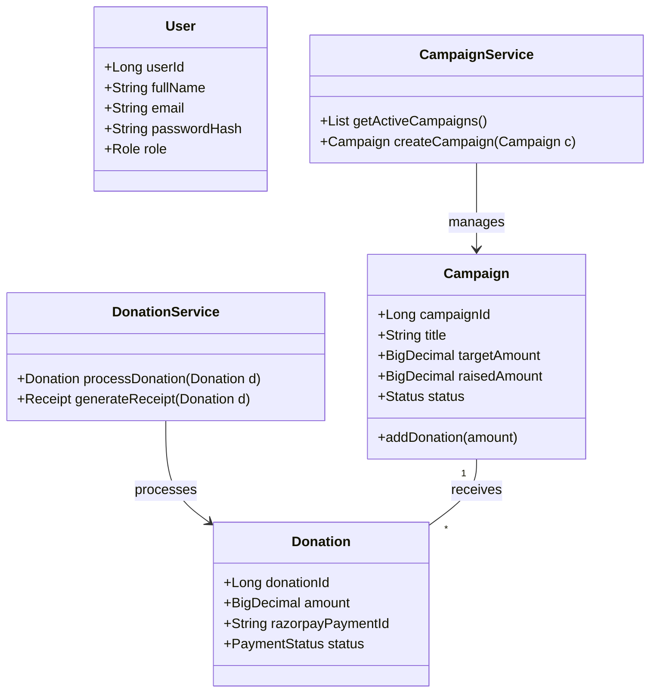
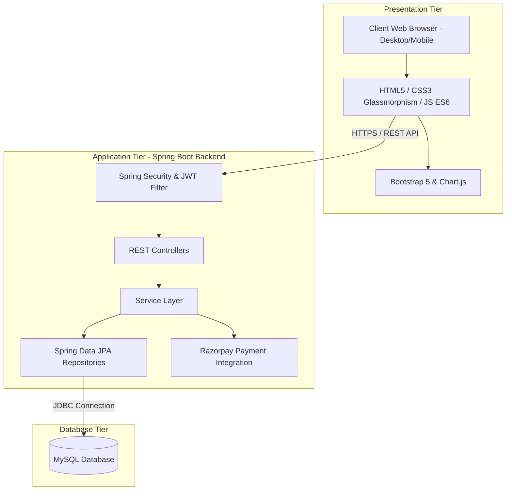
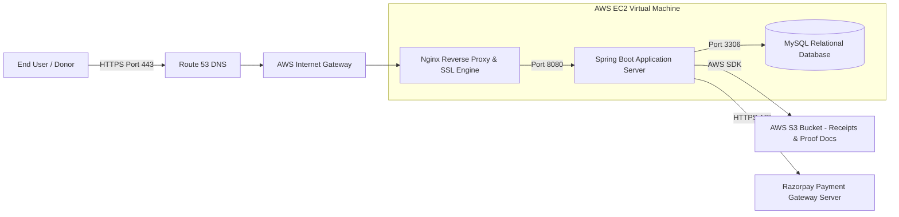

# NGO Donation & Impact Tracking Dashboard - System Diagrams

This document contains visual architectural diagrams created in GFM Mermaid format for academic Capstone Project submission.

---

## 1. Flowchart Diagram
Visualizing the user navigation and donation payment flow.



---

## 2. Use Case Diagram
Mapping user roles (Donor, NGO Admin, System Admin) to system features.

```mermaid
usecaseDiagram
    actor Donor
    actor NGOAdmin as NGO Admin
    actor SystemAdmin as System Admin

    rectangle "NGO ImpactHub System" {
        usecase UC1 as "Browse & Filter Campaigns"
        usecase UC2 as "Donate via Razorpay"
        usecase UC3 as "Download 80G Tax Receipts"
        usecase UC4 as "View Verified Impact Proof"
        usecase UC5 as "Create Fundraising Campaign"
        usecase UC6 as "Upload Impact Audit Reports"
        usecase UC7 as "Approve/Reject NGO & Campaigns"
        usecase UC8 as "View Platform Analytics"
    }

    Donor --> UC1
    Donor --> UC2
    Donor --> UC3
    Donor --> UC4

    NGOAdmin --> UC5
    NGOAdmin --> UC6
    NGOAdmin --> UC1

    SystemAdmin --> UC7
    SystemAdmin --> UC8
```

---

## 3. Activity Diagram
Process workflow when an NGO uploads an impact proof report.



---

## 4. Sequence Diagram
End-to-end Razorpay payment integration sequence.



---

## 5. ER Diagram (Entity-Relationship)
Database relational schema showing 3NF structure.



---

## 6. Class Diagram
Object-oriented class structure of Spring Boot backend.



---

## 7. Architecture Diagram
3-Tier Enterprise Web Application Architecture.



---

## 8. Deployment Diagram
AWS EC2, Nginx Reverse Proxy, and Managed Cloud Infrastructure.


